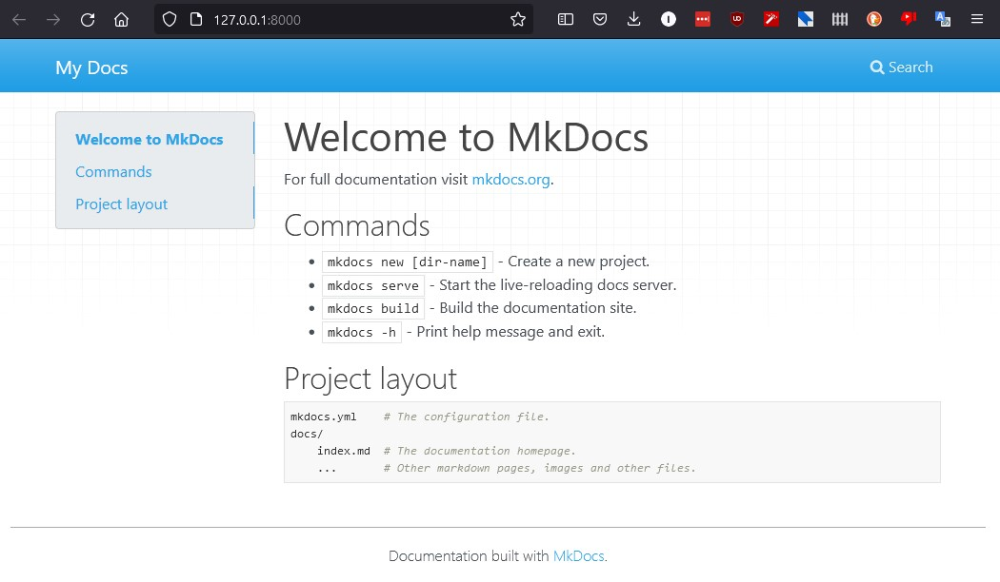
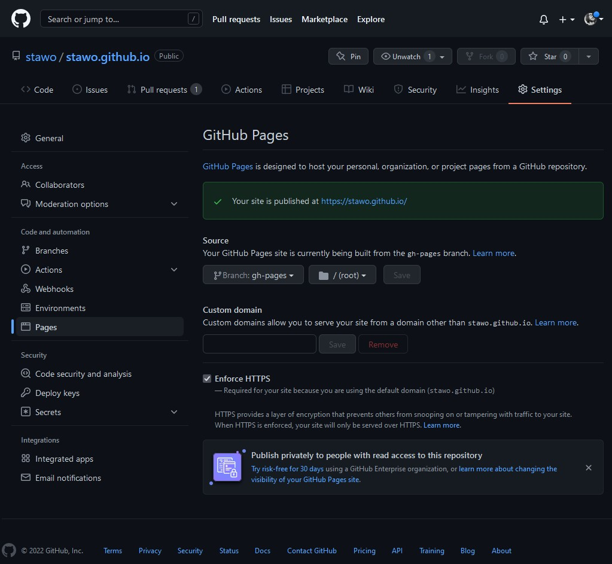

## Introduction

Many times I thought I would like a website where to share some of my knowledge, write some technical articles.  
Not sure if anyone would read it, but at least I knew what I wanted from it:

* **as simple to manage as possible**  
  I'm not a designer (although I like design) and don't want to loose my mind in building and managing a website.
* **write like a dev**  
  I would like to improve my coding skills, and write better documentation directly in my repos.  
  I thought "Why couldn't I write articles in the same way as I write code? Maybe simply using Markdown?"
* **own the source code**  
  Although there are many platforms for blogging, I usually dislike the idea of not owning the "source code" of my articles, i.e., each platform uses different styles/codes and it's difficult to download everything you write

The solution I came up with is:

* use **GitHub** to store my site and use **GitHub Pages** to display it
* use **MkDocs** and **MkDocs Material** to write everything in Markdown and transform it into a nice looking website
* use **GitHub Actions** to automatize the deployment of changes and publishing of new articles

Here is a simple description of how this website was created and how I covered the aforementioned needs.

## Initial Website

These are the steps I followed to have a working website with automatic updates when I write something.

Create an empty repository named `{git username}.github.io`.  
For example, in my case it's `stawo.github.io`.


From the web interface, create the file `.gitignore`, just add a space in it (otherwise you cannot save it), and commit it.  
This step is useful to initiate the repo and avoid having to do it locally on the computer later on.

(optional, but strongly suggested) Create conda env with `mkdocs` installed and activate it:
```
conda create --name stawo.github.io python=3.10 mkdocs-material
conda activate stawo.github.io
```

If you don't have/want `conda`, just run:
```
pip install mkdocs-material
```

Clone the repository on computer and access the root folder.  
In my case, I opened the terminal, went to my repositories folder, and ran:  
```
git clone https://github.com/stawo/stawo.github.io.git
cd stawo.github.io.git
```

Initialize the website with MkDocs by executing
```
mkdocs new .
```

and test it by running
```
mkdocs serve
```

This should give the following website at the address http://127.0.0.1:8000/


Build the website by running
```
mkdocs build
```
This generates the folder `site/` with many files in it.  
This is the final website that we want to publish, but not in this way.

Add `site/` to `.gitignore`, so that we can build locally with `mkdocs build` to test things but avoid having the generated files in git.  
We can test it by running `git status` and see that the generated files in the folder `site/` do not appear. You should see only `docs/` and `mkdocs.yml`


Create the folder `.github/workflows` and add file `build_site.yml` with following code ([from https://github.com/marketplace/actions/deploy-mkdocs](https://squidfunk.github.io/mkdocs-material/publishing-your-site/#github-pages)):
```yaml
name: Publish site via GitHub Pages
on:
  push:
    branches:
      - main

jobs:
  build:
    name: Deploy docs
    runs-on: ubuntu-latest
    steps:
      - name: Checkout main
        uses: actions/checkout@v2

      - name: Setup Python
        uses: actions/setup-python@v2
        with:
          python-version: 3.x
      
      - name: Install libraries
      - run: pip install mkdocs-material
      
      - name: Generate docs
      - run: mkdocs gh-deploy --force
```

Commit changes.  
This will trigger the GitHub Actions.
If all goes fine, the branch `gh-pages` will be created with the mkdocs build of our website.  
Check the progress of the pipeline on the repo website under `Actions`.

To publish the generated website, go on the GitHub website of the repo, go to `Settings->Pages` and select the branch `gh-pages` as the source.  
The website will be visible at the address `https://{git username}.github.io/`.  
For example, in my case it's <https://stawo.github.io/>.



**Note**: it takes a little bit of time for GitHub to pick up changes, so don't worry if you get an error, just retry to refresh the page.

### Resources

- <https://squidfunk.github.io/mkdocs-material>
- <https://squidfunk.github.io/mkdocs-material/publishing-your-site/#github-pages>

## Power-up: Blog!

Already with the previous set up you can publish things, but I'm lazy, and I would like that whenever I write an article (i.e., a Markdown file), this will automatically added and published without touching anything else.

To do that, we can use the plugin [Mkdocs Blogging Plugin](https://liang2kl.github.io/mkdocs-blogging-plugin/).

Install the plugin:
```
pip install mkdocs-blogging-plugin
```

To tell the plugin that everything in the folder `articles` should be considered an article and automatically publish it, modify `mkdocs.yml` and make it look something like this:  
```yaml
site_name: My Docs

site_url: https://stawo.github.io/

plugins:
  - search
  - blogging:
    dirs:
      - articles
```

**Note**: we added `- search` as we need to re-enable the search bar (see <https://squidfunk.github.io/mkdocs-material/setup/setting-up-site-search/#built-in-search>)

We also have to modify `build_site.yml` like this:

```yaml
name: Publish site via GitHub Pages
on:
  push:
    branches:
      - main

jobs:
  build:
    name: Deploy docs
    runs-on: ubuntu-latest
    steps:
      - name: Checkout main
        uses: actions/checkout@v2
        with:
          fetch-depth: 0

      - name: Setup Python
        uses: actions/setup-python@v2
        with:
          python-version: 3.x
      
      - name: Install libraries
      - run: pip install \
          mkdocs-material \
          mkdocs-blogging-plugin
      
      - name: Generate docs
      - run: mkdocs gh-deploy --force
```

And done!  
You now have an automated blog :smile: